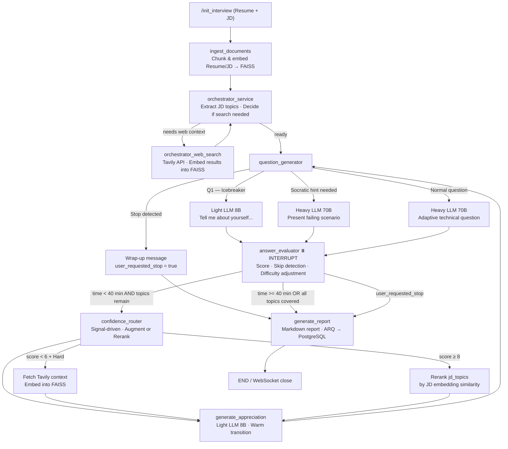

# Agentic AI Interviewer

An advanced, real-time agentic AI system that conducts fully adaptive, context-aware technical interviews. Upload a candidate's Resume and a Job Description — the system orchestrates the entire interview autonomously: from a warm icebreaker opening, through adaptive technical questioning, to a structured final report.

> **Fast start:** Thanks to in-process FAISS and embedding model caching, interviews start in **~1/5th the time (400% faster)** on warm sessions — the embedding model loads once at process startup and each session's vector store is held in memory, eliminating repeated disk I/O between questions.

## How It Works

## Key Features

| Feature | Detail |
|---|---|
| **Closed-Loop Confidence Routing** | A `confidence_router` node between evaluation and the next question enriches FAISS with targeted web context on failing Hard topics, and reranks the topic queue by JD embedding similarity on mastered topics — converting the pipeline into an adaptive control loop. |
| **Warm Icebreaker** | Every interview starts with a conversational opener ("Tell me about yourself") generated by the lightweight 8B model. |
| **Adaptive Difficulty** | Difficulty scales ±1 level per turn based on score; Hard unlocked only after a Medium ≥ 8. |
| **Socratic Failure Protocol** | On first failure (score ≤ 5), a concrete failing scenario is presented instead of moving on — max 1 hint per topic. |
| **Topic Burn** | Skipped or double-failed topics are permanently burned; no re-testing. |
| **Rate Limit Resilience** | Automatic retries with exponential backoff (5 attempts); falls back 70B → Mixtral → 8B; graceful interview conclusion if fully exhausted. |
| **Token Optimization** | Light 8B model for classifiers, condensed prompts, sliding-window history (last 5), FAISS context capped and truncated. |
| **In-Process Caching** | `all-MiniLM-L6-v2` loads once at process start (~1–2 s cold, then ~0 ms). Each session's FAISS store is kept in a process-level dict — the 3–5 `load_faiss_index` calls per turn skip disk I/O entirely after the first, eliminating ~150–1000 ms of latency per question turn. Cache entry is evicted on report generation. **As a result, interviews start in ~1/5th the time on warm sessions compared to a cold, cache-less startup.** |
| **WebSocket Durability** | Rate-limit errors send a friendly "please wait" message; connection stays alive; state persists across disconnects. |
| **Refresh Recovery** | `sessionId`, status, full message history, and elapsed time are persisted to `sessionStorage` on every change. Refreshing the page restores the UI instantly; if the interview was in progress, the WebSocket reconnects to the same session automatically. A **New Interview** button lets the candidate start over after completion. |
| **Dynamic RAG** | Tavily results are embedded back into FAISS. Search is gated to Hard questions with no existing local context, and results are cached in `_tavily_topic_cache` per topic. In a typical 6-question interview this reduces Tavily calls from ~12 to ~2 — an ~83% reduction — cutting ~2–5 s of accumulated network latency per interview. |

## Tech Stack

### Backend
- **Runtime:** Python 3.11+, FastAPI (HTTP & WebSockets)
- **Agent Orchestration:** LangGraph (StateGraph with interrupt/resume)
- **LLM Engine:** Groq — `llama-3.3-70b-versatile` (heavy), `mixtral-8x7b-32768` (fallback), `llama-3.1-8b-instant` (light/classifier)
- **Retry Layer:** `tenacity` — 5-attempt exponential backoff, 3-model fallback chain
- **Vector DB / RAG:** FAISS + HuggingFace Embeddings (`all-MiniLM-L6-v2`, loaded once as a process-level singleton); per-session FAISS stores cached in-process
- **State & Queue:** Redis (`AsyncRedisSaver` session TTL, ARQ worker queue)
- **Database:** PostgreSQL (NeonDB) via Prisma ORM
- **Web Search:** Tavily API

### Frontend
- **Framework:** React + Vite + TypeScript
- **Styling:** Tailwind CSS + Lucide React
- **Real-time:** Native WebSockets
- **HTTP Client:** Axios
- **Session Persistence:** `sessionStorage` (survives page refresh within the same tab)

## Security posture

This is a **portfolio / demo project** — no authentication or authorisation is implemented by design.

| Assumption | Implication |
|---|---|
| No auth on any endpoint | Anyone with network access to the backend can open a session or connect to any `session_id`'s WebSocket. In a production deployment, add an auth layer (API key, JWT, OAuth) in front of `/init_interview` and `/ws/interview/*`. |
| No rate limiting per user | A single client can open unlimited sessions. Add per-IP or per-token rate limiting for public deployments. |
| FAISS indexes written to disk | Indexes are deleted when a session's report is generated. Long-running or abandoned sessions leave a directory on disk until the process restarts; ensure the host has adequate disk headroom. |
| `allow_dangerous_deserialization` on FAISS load | FAISS uses pickle internally. The flag is safe here because only the server writes the indexes, and paths are server-generated UUIDs — never user-supplied. |

## Getting Started

1. **Clone** the repository.
2. Follow the [Backend Setup Guide](docs/setup_guide.md) to install dependencies and configure API keys in `.env`.
3. Install the new dependency: `pip install tenacity`
4. Run Prisma migrations.
5. Start the FastAPI server, DB worker, and Ingestion worker.
6. In `frontend/`, create `.env`, run `npm install` and `npm run dev`.

## Documentation

- [Architecture Overview](docs/architecture.md)
- [Setup & Installation Guide](docs/setup_guide.md)
- [Backend Instructions](docs/project_instructions.md)
- [Project Walkthrough](docs/walkthrough.md)
