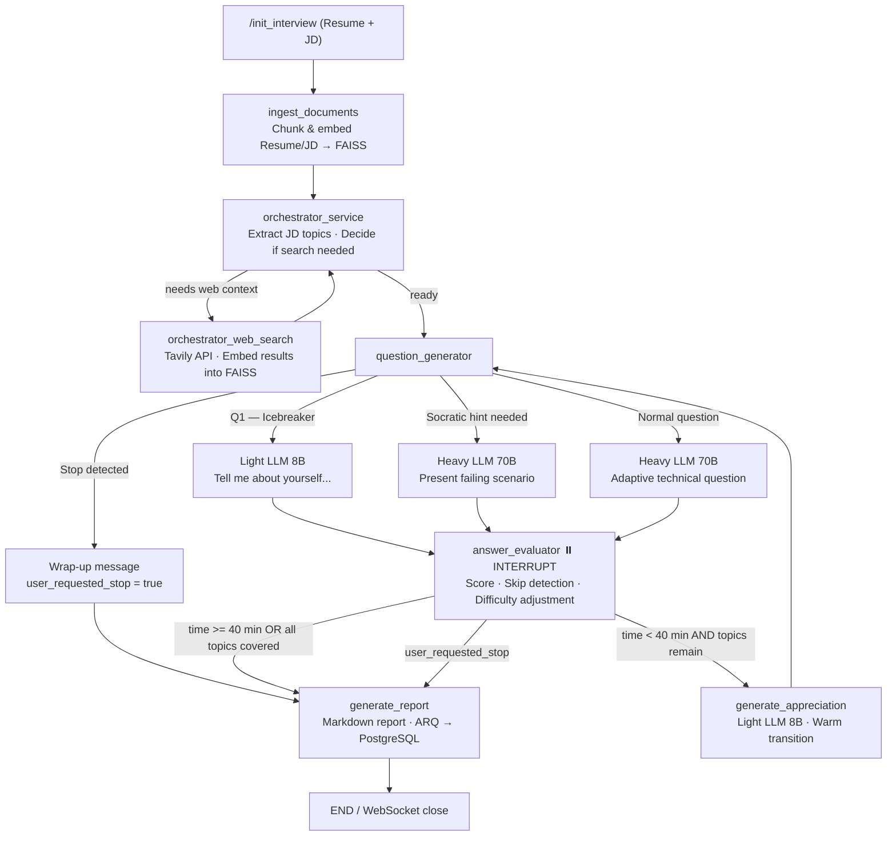

# Agentic AI Interviewer

An advanced, real-time agentic AI system that conducts fully adaptive, context-aware technical interviews. Upload a candidate's Resume and a Job Description — the system orchestrates the entire interview autonomously: from a warm icebreaker opening, through adaptive technical questioning, to a structured final report.

## How It Works

## Key Features

| Feature | Detail |
|---|---|
| **Warm Icebreaker** | Every interview starts with a conversational opener ("Tell me about yourself") generated by the lightweight 8B model. |
| **Adaptive Difficulty** | Difficulty scales ±1 level per turn based on score; Hard unlocked only after a Medium ≥ 8. |
| **Socratic Failure Protocol** | On first failure (score ≤ 5), a concrete failing scenario is presented instead of moving on — max 1 hint per topic. |
| **Topic Burn** | Skipped or double-failed topics are permanently burned; no re-testing. |
| **Rate Limit Resilience** | Automatic retries with exponential backoff (5 attempts); falls back 70B → Mixtral → 8B; graceful interview conclusion if fully exhausted. |
| **Token Optimization** | Light 8B model for classifiers, condensed prompts, sliding-window history (last 5), FAISS context capped and truncated. |
| **WebSocket Durability** | Rate-limit errors send a friendly "please wait" message; connection stays alive; state persists across disconnects. |
| **Dynamic RAG** | Tavily search results are embedded back into FAISS in real time, enriching future questions. |

## Tech Stack

### Backend
- **Runtime:** Python 3.11+, FastAPI (HTTP & WebSockets)
- **Agent Orchestration:** LangGraph (StateGraph with interrupt/resume)
- **LLM Engine:** Groq — `llama-3.3-70b-versatile` (heavy), `mixtral-8x7b-32768` (fallback), `llama-3.1-8b-instant` (light/classifier)
- **Retry Layer:** `tenacity` — 5-attempt exponential backoff, 3-model fallback chain
- **Vector DB / RAG:** FAISS + HuggingFace Embeddings (`all-MiniLM-L6-v2`)
- **State & Queue:** Redis (`AsyncRedisSaver` session TTL, ARQ worker queue)
- **Database:** PostgreSQL (NeonDB) via Prisma ORM
- **Web Search:** Tavily API

### Frontend
- **Framework:** React + Vite + TypeScript
- **Styling:** Tailwind CSS + Lucide React
- **Real-time:** Native WebSockets
- **HTTP Client:** Axios

## Getting Started

1. **Clone** the repository.
2. Follow the [Backend Setup Guide](docs/setup_guide.md) to install dependencies and configure API keys in `.env`.
3. Install the new dependency: `pip install tenacity`
4. Run Prisma migrations.
5. Start the FastAPI server, DB worker, and Ingestion worker.
6. In `frontend/`, create `.env`, run `npm install` and `npm run dev`.

## Documentation

- [Architecture Overview](docs/architecture.md)
- [Setup & Installation Guide](docs/setup_guide.md)
- [Backend Instructions](docs/project_instructions.md)
- [Project Walkthrough](docs/walkthrough.md)
