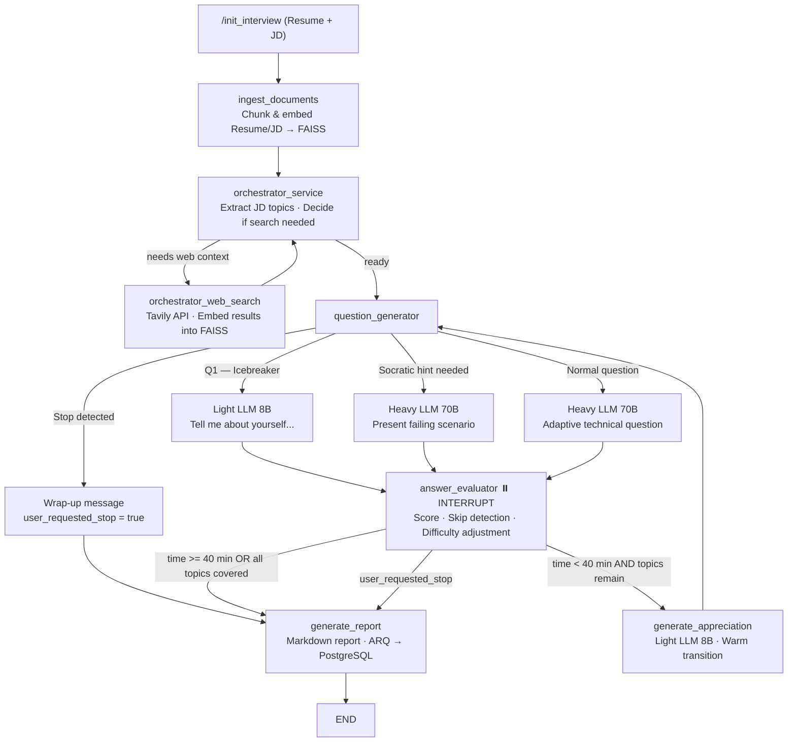

# Architecture Overview

The **Agentic AI Interviewer** is structured as a decoupled, event-driven system: a React frontend communicates over WebSockets with a FastAPI backend, which drives a LangGraph state machine backed by Groq LLMs, FAISS vector stores, Redis, and PostgreSQL.

---

## System Diagram



---

## Component Breakdown

### 1. Client — React / Vite / TypeScript
- Uploads Resume & JD via `POST /init_interview`.
- Polls `GET /status/{session_id}` until the session is ready.
- Opens a WebSocket and renders a chat-like interface with typewriter-effect streaming, evaluation badges, and the final report.
- **Session Persistence (`sessionStorage`):** `sessionId`, `status`, message history, and elapsed time are written to `sessionStorage` on every state change. On mount the app reads these values to restore UI state immediately. If the saved status was `interviewing`, a new WebSocket is opened to the same `session_id` so the candidate can continue answering after an accidental page refresh.
- **New Interview:** Once an interview ends a "New Interview" button clears `sessionStorage` and resets all client state back to `idle`.
- **Disconnect Resilience:** If the WebSocket connection drops, state is securely persisted on the server, permitting reconnections without data loss.

### 2. FastAPI Server (`app.py`)
- **HTTP layer:** Generates `session_id`, streams documents to FAISS, and seeds Redis with session state.
- **WebSocket layer:** Acts as the bridge between the frontend and the LangGraph state machine — injects human answers into the graph state and routes typed messages (`question`, `evaluation`, `status`, `rate_limit`, `report`) to the client.
- **Rate-limit resilience:** Transient 429 errors send a friendly `rate_limit` message and wait 15s without closing the connection. If `RateLimitExhaustedError` is raised (all 5 retries across all fallback models fail), a partial report is generated from completed evaluations and the session is concluded gracefully.

### 3. LangGraph Agentic Orchestrator

#### Nodes

| Node | Model | Description |
|---|---|---|
| `ingest_documents` | — | Chunks Resume + JD, embeds via HuggingFace `all-MiniLM-L6-v2` (model loaded once as a process-level singleton), stores in session-scoped FAISS index |
| `orchestrator_service` | Light (8B) | Extracts `jd_topics` from JD context; decides if web search is needed |
| `orchestrator_web_search` | — | Runs Tavily query; embeds results back into FAISS for use by later nodes |
| `question_generator` | Light/Heavy | **Four operational modes** (see below) |
| `answer_evaluator` | Heavy (70B) | Scores answer 1–10, detects skip intent, adjusts difficulty, triggers hint or burns topic |
| `generate_report` | Heavy (70B) | Produces a structured Markdown report; enqueues async DB write via ARQ |

#### Question Generator — Four Modes

```
Mode A  Stop Detection   [Light 8B]  Classifies if the candidate wants to end the interview
Mode B  Socratic Hint    [Heavy 70B] Presents a concrete failing scenario without revealing the answer
Mode C  Icebreaker       [Light 8B]  First question only — warm opener about background/experience
Mode D  Normal Question  [Heavy 70B] Topic-targeted technical question at the current difficulty level
```

#### Graph Routing Flow
The state machine implements a dual-termination strategy bounded by a 40-minute duration limit or complete topic coverage, paired with dynamic capability routing.
1. Document ingestion and topic evaluation loops with web searches until sufficient topic mastery is gained.
2. The `answer_evaluator` leverages the Human-in-the-loop interruption pause.
3. Depending on evaluation: candidate performance dynamically alters difficulty (Easy, Medium, Hard). Socratic hint nodes loop backwards without topic burn until answered correctly or skipped. 
4. Stop sequences instantly pivot the routing straight into reporting.

### 4. LLM Engine — Groq + Tenacity

#### Model Routing Strategy
- **Heavy** (`llama-3.3-70b-versatile`): Question generation, answer evaluation, report writing.
- **Medium** (`gemma2-9b-it`): Automatic fallback when heavy model hits rate limits.
- **Light** (`llama-3.1-8b-instant`): Icebreaker, stop detection, topic extraction, search decisions.

#### Retry Layer (`LLM/__init__.py`)
Utilizes exponential backoff (2s → 60s max) combined with an orchestrated 3-tiered fallback chain to handle rate limiting and API exhaustion safely on a node level.

### 5. Token Optimization Measures
| Technique | Impact |
|---|---|
| Light model for classifiers | ~5× cheaper per classifier call |
| Condensed prompts | ~30–40% fewer tokens per LLM call |
| `max_tokens` caps | 5 tokens for classifiers, 256 for light generation, 512–1024 for heavy evaluation |
| Sliding-window history | Only the last 5 evaluations are sent as context |
| FAISS context truncation | Retrieved chunks capped at 400 chars; `k` reduced dynamically across all nodes |
| Search context capping | Max 2 results fetched for questions, 1 for evaluation |
| Gated + cached web search | Tavily is no longer called every turn. `question_generator` searches only for **Hard** questions that have no cached Tavily context in FAISS yet; `answer_evaluator` fact-checks only for **Hard** answers when local FAISS context is empty. Results are memoized in a process-level cache (keyed by topic for generation, by question prefix for evaluation), so each is fetched at most once per process — removing a network round-trip from the hot path of most turns |
| Embeddings model singleton | `all-MiniLM-L6-v2` is loaded once at process level and reused, instead of re-instantiated on every node call |
| In-process FAISS cache | Each session's FAISS store is held in memory keyed by `session_id`, so nodes reuse the loaded index instead of reading from disk every call; the entry is evicted in `generate_report` to keep memory bounded |

### 5a. Performance Impact of Caching Optimizations

#### Embeddings singleton + in-process FAISS cache (sugg.md §2.1)

Each question-answer turn hits `load_faiss_index` from 3–5 nodes (`orchestrator_service`, two similarity searches in `question_generator`, `answer_evaluator`). Before caching, every call paid the full cost:

| Cost | Before | After |
|---|---|---|
| Embeddings model load (`all-MiniLM-L6-v2`) | ~1–2 s on first call, repeated each node invocation | **~0 ms** — loaded once at process startup, reused forever |
| FAISS index disk read | ~50–200 ms per call (varies with index size) | **~0 ms** — served from the in-process `_faiss_cache` dict on all calls after the first |
| Net saving per turn (3–5 node calls) | — | **~150–1000 ms** eliminated from the critical path per question |

The embeddings singleton alone removes what was effectively a multi-second cold-start penalty that compounded across every node in the graph.

#### Gated + cached Tavily search (sugg.md §2.2)

Before the gate, both `question_generator` and `answer_evaluator` called Tavily on every turn regardless of difficulty or available context. Each call adds a ~300–800 ms network round-trip and consumes API quota.

| Scenario | Tavily calls before | Tavily calls after |
|---|---|---|
| Easy / Medium question | 1 call (question gen) + 1 call (eval) = **2 per turn** | **0** — gated out entirely |
| Hard question, topic already cached | 2 per turn | **0** — served from `_tavily_topic_cache` |
| Hard question, first time seeing topic | 2 per turn | **1** — question gen fetches and caches; eval reuses |

In a typical 6-question interview (4 Easy/Medium, 2 Hard with 1 new topic each):
- **Before:** up to 12 Tavily calls
- **After:** at most 2 Tavily calls
- **~83% reduction in external search calls**, cutting ~2–5 s of accumulated network latency per interview and eliminating the majority of per-turn Tavily API cost

### 6. State Machine Schema (`InterviewState`)
21 state fields maintain the progression context, including new behavioral modifiers:
```python
start_time                 # Evaluates 40-minute limits
current_difficulty         # Tracks and shifts scaling difficulty (Easy, Medium, Hard)
user_requested_stop        # Hard stop flag — bypasses all routing checks
requires_hint              # Socratic failure trigger
failed_condition_context   # Employs previous answer to format failure-scenario based targeted Socratic hints
covered_topics             # Records tested nodes ensuring no re-testing of the same metric across interview lifespan
```
*Facilitated natively using `AsyncRedisSaver` for efficient scaling across worker tasks and thread retention during potential timeouts.*

### 7. Background Workers
- **ARQ DB Worker:** Listens on Redis for `process_db_write` jobs enqueued by `generate_report`. Writes transcripts, scores, and reports to PostgreSQL (NeonDB via Prisma) asynchronously without blocking API event loops.

## Directory Structure
- `backend/app.py`: FastAPI entry point, WebSocket bridging, and async worker binding.
- `backend/src/agentic_ai_interviewer/`: Context root module.
  - `graph/`: LangGraph structural orchestration logic (`build_graph()`).
  - `nodes/`: Operational components dictating the LangGraph step execution (ingestion, question generator, answer evaluations, searches).
  - `LLM/`: Advanced ChatGroq model configurations paired natively with Tenacity fallback wrappers.
  - `tools/`: FAISS index manipulation (with a process-level embeddings singleton and an in-process per-session index cache) and web API calls.
  - `workers/`: Background Redis jobs logic.
- `frontend/src/App.tsx`: Real-time streaming Vite interfaces.
- `docs/`: Deployment instruction sets, architectural logic details, and update tracking records.
