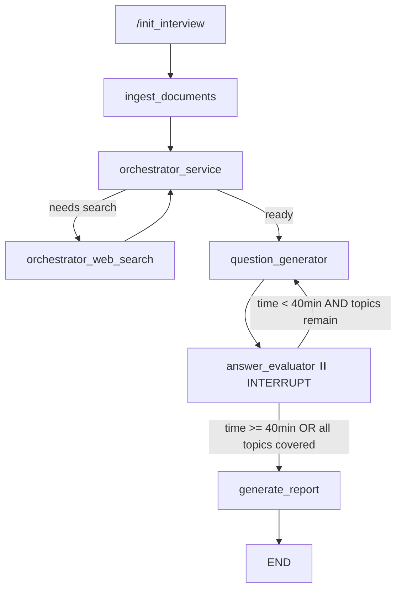

# AI Interviewer Backend — Upgrade Walkthrough

## Summary

Upgraded the agentic AI Interviewer backend from a basic question-counting system to a fully adaptive, production-grade interview engine with topic tracking, difficulty scaling, time-gated completion, and dynamic knowledge augmentation.

## Architecture



## Files Changed

### Core Modules

| File | Change | Key Detail |
|------|--------|------------|
| [state/__init__.py](file:///c:/Users/Debanshu%20Ghosh/Desktop/projects/ai_interviewer/backend/src/agentic_ai_interviewer/state/__init__.py) | Rewritten | Added `start_time`, `jd_topics`, `covered_topics`, `current_difficulty`, `evaluator_feedback`, `resume_text`, `jd_text` |
| [tools/vectorstore.py](file:///c:/Users/Debanshu%20Ghosh/Desktop/projects/ai_interviewer/backend/src/agentic_ai_interviewer/tools/vectorstore.py) | Enhanced | New [add_documents_to_index()](file:///c:/Users/Debanshu%20Ghosh/Desktop/projects/ai_interviewer/backend/src/agentic_ai_interviewer/tools/vectorstore.py#38-57) for dynamic FAISS augmentation |
| [LLM/__init__.py](file:///c:/Users/Debanshu%20Ghosh/Desktop/projects/ai_interviewer/backend/src/agentic_ai_interviewer/LLM/__init__.py) | Updated | Model upgraded to `llama-3.3-70b-versatile` |

### Nodes & Graph

| File | Change | Key Detail |
|------|--------|------------|
| [nodes/__init__.py](file:///c:/Users/Debanshu%20Ghosh/Desktop/projects/ai_interviewer/backend/src/agentic_ai_interviewer/nodes/__init__.py) | Major rewrite | 6 async nodes with adaptive difficulty, FAISS+Tavily augmentation, topic tracking |
| [graph/__init__.py](file:///c:/Users/Debanshu%20Ghosh/Desktop/projects/ai_interviewer/backend/src/agentic_ai_interviewer/graph/__init__.py) | Simplified | 6-node topology, [check_interview_status](file:///c:/Users/Debanshu%20Ghosh/Desktop/projects/ai_interviewer/backend/src/agentic_ai_interviewer/graph/__init__.py#62-81) for time/topic termination |

### Application & Config

| File | Change | Key Detail |
|------|--------|------------|
| [app.py](file:///c:/Users/Debanshu%20Ghosh/Desktop/projects/ai_interviewer/backend/app.py) | Major rewrite | `AsyncRedisSaver`, inline ingestion, 60-min TTL, disconnect resilience |
| [requirements.txt](file:///c:/Users/Debanshu%20Ghosh/Desktop/projects/ai_interviewer/backend/requirements.txt) | Updated | Added `langgraph-checkpoint-redis`, `langchain-text-splitters` |

## Key Features Implemented

- **Adaptive Difficulty**: Score ≤ 3 → difficulty decreases; Score ≥ 8 → difficulty increases
- **Topic Tracking**: `jd_topics` extracted from JD, `covered_topics` tracked per answer
- **Dual Termination**: 40-minute timer OR all topics covered
- **Dynamic FAISS**: Tavily search results embedded back into the vector store
- **Redis Persistence**: `AsyncRedisSaver` checkpointer with 60-min session TTL
- **Disconnect Resilience**: WebSocket drops don't lose state; clients can reconnect

## Validation Results

- ✅ Python syntax validation passed for all 6 source files
- ✅ [InterviewState](file:///c:/Users/Debanshu%20Ghosh/Desktop/projects/ai_interviewer/backend/src/agentic_ai_interviewer/state/__init__.py#4-39) imports correctly with all 17 fields
- ✅ `AsyncRedisSaver` import path verified (`from langgraph.checkpoint.redis.aio`)

## How to Run

```bash
# 1. Install dependencies
cd backend
pip install -r requirements.txt

# 2. Ensure .env has GROQ_API_KEY, TAVILY_API_KEY, REDIS_URL
# 3. Start the server
uvicorn app:app --reload --host 0.0.0.0 --port 8000
```

## WebSocket Message Protocol

| Direction | Type | Fields |
|-----------|------|--------|
| Server → Client | [question](file:///c:/Users/Debanshu%20Ghosh/Desktop/projects/ai_interviewer/backend/src/agentic_ai_interviewer/nodes/__init__.py#179-289) | `content`, `difficulty`, `question_number` |
| Server → Client | `evaluation` | `score`, `feedback`, `topic_tested`, `difficulty` |
| Server → Client | [report](file:///c:/Users/Debanshu%20Ghosh/Desktop/projects/ai_interviewer/backend/src/agentic_ai_interviewer/nodes/__init__.py#428-499) | `content`, `summary` |
| Server → Client | [status](file:///c:/Users/Debanshu%20Ghosh/Desktop/projects/ai_interviewer/backend/app.py#157-163) | `content` ("processing", "evaluating") |
| Client → Server | text | Raw answer string |
